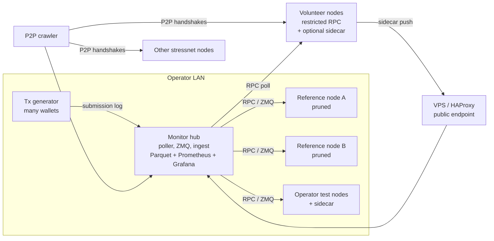

# StressNet Monitor: Design Overview

> **Status:** draft for feedback. No code yet. Comments, corrections and "you forgot X" are very welcome.

## Goal

Find the **minimum hardware needed to run a Monero node with FCMP++ under heavy network load**. In other words: if Monero becomes very popular and carries far more transactions per day than it does now, what hardware does a node need to keep the network running smoothly?

We will measure this on the **FCMP++ & Carrot beta stressnet v3** ([`v0.19.0.0-beta.3.0`](https://github.com/seraphis-migration/monero/releases/tag/v0.19.0.0-beta.3.0)). It hard-forks from testnet at **block 3102800 on 2026-10-05**, and a follow-up fork (v18) comes at 3103520. The run is expected to last several weeks, up to about a month.

Priorities, in order:

1. **Raw data** that a person can analyze (Parquet, readable from R and Python).
2. A **live public dashboard**.
3. Help with **bug reports** to the FCMP++ team, by capturing logs and backtraces when nodes crash, stall or fork.
4. A **summary report** at the end.

## What loads a node under FCMP++

The monitor's design follows from where the work actually happens:

- **When a transaction arrives.** Transactions are fully verified when they enter a node's mempool, including the FCMP++ membership proofs, which cost much more than CLSAG ring signatures. A node has to keep verifying at the network's transaction rate continuously, not only when blocks arrive.
- **When a block arrives.** Blocks spread as "fluffy blocks" (transaction hashes, not full transactions). If a node's mempool has fallen behind, it must fetch the missing transactions before it can accept the block. Adding a block also includes FCMP++ curve-tree growth (`advance_tree`), a cost that grows with the number of outputs.
- **Over time.** The LMDB database grows, and eventually the set of data a node keeps touching outgrows its RAM. A machine that keeps up on day 1 may not on day 30.
- **Block size is not a setting.** Monero's block size adjusts on its own: it follows a median of recent blocks, with a penalty. The input we control is **transaction load**: the rate and the mix of input and output counts. Block weight follows from that. Results will therefore be expressed in transactions per second or per day as well as block weight.

## Architecture



| Component | What it does |
|---|---|
| **Reference nodes (2×)** | Well-provisioned, pruned nodes that define the canonical chain and when each block first appeared. There are two so that if one stalls, the data isn't lost, and so they can check each other. The monitor also watches the references and flags any period when one was behind. |
| **Hub** | Polls RPC, subscribes to ZMQ, receives sidecar pushes, writes raw data to Parquet files split by day, and serves Prometheus/Grafana for the live view. |
| **Sidecar** | A **bash script** (Linux only) that runs next to `monerod`. It uses only bash built-ins, samples `/proc` every ~5 s, parses `monerod`'s log, and pushes a batch to the hub every 30–60 s with one `curl` call. It opens no ports. Volunteers can read the whole script before running it. |
| **P2P crawler** | Reads the P2P handshake data (height, top hash, cumulative difficulty, support flags) from every node it can reach, including nodes nobody instruments. It separates stressnet nodes from testnet nodes that didn't upgrade (same ports and network ID). |
| **Tx generator log** | One JSON line per submitted transaction: txid, submit time, input and output counts, weight, fee, which node it was sent to, and whether it was accepted. This lets us trace each transaction from submission through every node into a block. |

### Node tiers

| Tier | Data we get |
|---|---|
| **Fully instrumented** (operator nodes) | RPC, ZMQ (every transaction and block arrival), sidecar (OS metrics, per-block timing breakdown, crash capture) |
| **Volunteer + sidecar** | Restricted RPC, sidecar, and optionally the ZMQ publish port (a 1% sample of transactions, chosen by txid hash so every node samples the same ones) |
| **Volunteer, RPC only** | Restricted RPC: height, top hash, cumulative difficulty, pool size. No build version (restricted mode leaves it blank) and no cause for failures. |
| **Uninstrumented** | P2P crawler only |

## What we measure

**For each block on each node:**
- **Acceptance delay:** when this node accepted the block, minus when the first reference node did.
- **Where the time went,** from `monerod --show-time-stats 1` with `blockchain` logging at INFO. The log line breaks block processing into steps, including `t_checktx`, `t_pool`, `addblock` and `advance_tree`.

**For each transaction:** when it arrived at each node, relative to when it was submitted.

**For each host:** CPU, iowait, load, memory, swap, disk usage and throughput, `monerod` RSS, and DB size.

**Hardware profile, detected automatically:** CPU model and cores, RAM, whether the disk is spinning or SSD, filesystem, `monerod` version, and whether the node is pruned.

**Network position:** same LAN as the tx generator, or remote. Nodes near the generator have an advantage, and the analysis must not mistake good placement for good hardware.

## Node states and outcomes

States are assigned continuously. Every threshold can be changed in config.

| State | Meaning |
|---|---|
| `OK` | At the tip, same hash as the references |
| `BEHIND` | Lagging, but the lag is steady or shrinking |
| `FALLING_BEHIND` | The lag is growing |
| `STALLED` | Reachable, but the height hasn't changed for N intervals while the network moved on |
| `UNRESPONSIVE` | RPC timeouts, but the TCP port is open |
| `DOWN` | Connection refused, or the host can't be reached |
| `FORKED` | On a chain that is valid but not canonical |
| `WRONG_CHAIN` | On testnet, or on an incompatible build (hash mismatch at `fork_height + 1`) |
| `SYNCING` | Initial sync or DB migration, excluded from the capability analysis |

**Outcome for each node at each load level:**
- **Kept up:** `OK` throughout.
- **Degraded, recovered:** fell behind at peak load but returned to the tip without anyone stepping in. This is **its own category**, neither a pass nor a fail.
- **Failed:** never recovered, crashed, or forked.

When sidecar data is available, each degraded or failed period gets a likely cause: **CPU**, **disk**, **memory** (swap or OOM) or **network**. Without a sidecar, a timeout can't be assigned a cause and is reported as "unknown cause."

## Bug capture

The sidecar also collects diagnostic bundles for bug reports:

- **Crash:** the tail of `monerod`'s log, the exit status, any OOM-killer entries from the kernel log, and a backtrace from the core dump (`coredumpctl` + `gdb -batch -ex "thread apply all bt"`) if core dumps are enabled.
- **Stall or hang:** log context, and optionally (off by default) a one-off live backtrace. This pauses `monerod` for a moment, so it only runs after a stall is confirmed.
- **Fork:** log context around the height where the node split off.

Bundles are uploaded to the hub. Peer IP addresses are removed from them before upload.

## Data outputs

- **Raw data:** Parquet files split by table and day, typed for R `arrow`/`duckdb`: UTC timestamps, no unsigned 64-bit columns, and 128-bit cumulative difficulty stored as a hex string plus a double. Tables: `node_poll`, `block_canonical`, `block_arrival`, `block_timing`, `tx_arrival`, `host_sample`, `node_event`, `crawler_peer`, `tx_submission`, `node_registry`.
- **Live dashboard:** Grafana. Nodes are shown under pseudonyms, and IP addresses are never published.
- **Starter R scripts:** lag per node, acceptance delay vs block weight and transaction rate, failure timelines, and the capability matrix (hardware class × load → outcome).

## Node setup (proposed)

```
monerod --testnet \
  --show-time-stats 1 \
  --log-level 0,blockchain:INFO \
  --zmq-pub tcp://0.0.0.0:28083      # operator nodes / opt-in volunteers
  --rpc-bind-ip 0.0.0.0 --confirm-external-bind --restricted-rpc   # volunteers
```

Test nodes should otherwise keep **default settings**, so that we measure the hardware and not tuning.

## Open questions for reviewers

1. What is **"heavy load"** in real-world terms? What multiple of current mainnet transactions per day should the stressnet aim for, and with what mix of input and output counts?
2. Are the per-block timing fields (`t_checktx`, `t_pool`, `advance_tree`, …) and the log categories chosen here the right ones for FCMP++, or is there better instrumentation in this build?
3. Should low-end hardware also be **emulated with controlled limits** (cgroup CPU/RAM limits, `tc` bandwidth shaping, a throttled or spinning disk) on well-understood machines, in addition to real old hardware?
4. Are there failure modes the node states above would miss?
5. Volunteers: what would you be willing to run (sidecar, ZMQ port, core dumps)?
