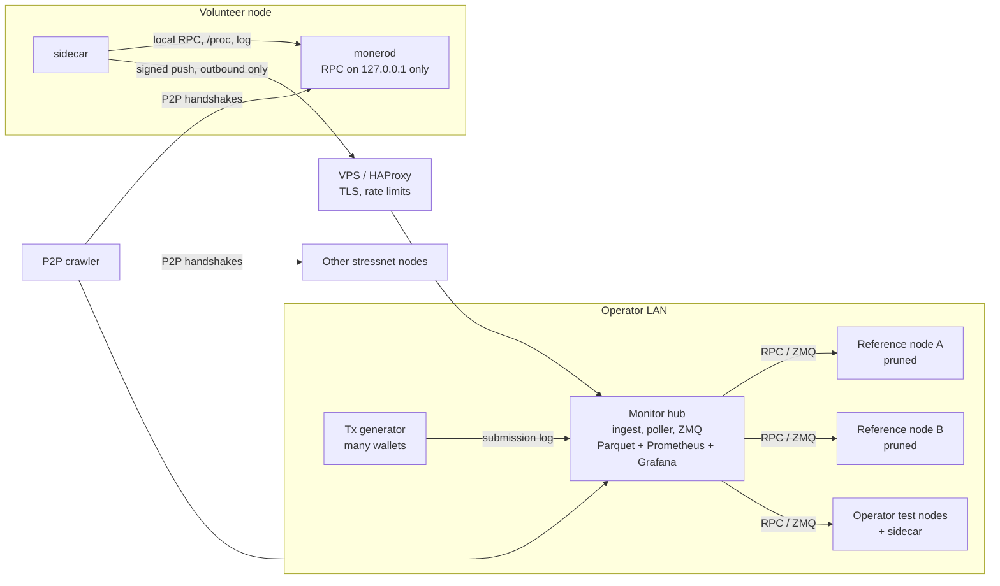

# StressNet Monitor: Design Overview

> **Status:** draft v2 for feedback. No code yet. Comments, corrections and "you forgot X" are very welcome.
> Discussion: [seraphis-migration/monero#495](https://github.com/seraphis-migration/monero/issues/495).

## Changes since v1

Based on feedback in #495 (thanks, Rucknium):

- **Volunteers no longer expose RPC.** The sidecar queries the node's *unrestricted* RPC on `127.0.0.1` and pushes the results out. Restricted RPC from outside gives little more than block height, and opening unrestricted RPC to the internet is a security risk.
- **Data format matches [`Rucknium/monerod-monitor`](https://github.com/Rucknium/monerod-monitor)** (same RPC calls, table names and column names), so existing R and Shiny tooling works on this data.
- **Finding bugs and "rough" behavior is now a main goal**, alongside the hardware question. A key example is nodes disagreeing on things they should agree on, such as txpool size.
- **Transaction volume is set by the stressnet operators.** The monitor observes and records the load; it doesn't control it.
- **Logging stays at INFO by default.** Deeper log levels slow the node, so they are turned on only temporarily, to investigate a specific bug.
- **Hardware emulation (cgroups, `tc`) is optional** and not a priority.
- **New section: [Data integrity](#data-integrity).**

## Goals

1. **Minimum hardware.** Find the minimum hardware needed to run a Monero node with FCMP++ under heavy network load. If Monero becomes very popular and carries far more transactions per day than it does now, what does a node need to keep the network running smoothly?
2. **Bugs and rough behavior.** Find and document bugs and "rough" behavior under stress (nodes disagreeing, stalls, bans, crashes), with enough captured context to file useful bug reports.

We will measure this on the **FCMP++ & Carrot beta stressnet v3** ([`v0.19.0.0-beta.3.0`](https://github.com/seraphis-migration/monero/releases/tag/v0.19.0.0-beta.3.0)). It hard-forks from testnet at **block 3102800 on 2026-10-05**, and a follow-up fork (v18) comes at 3103520. The run is expected to last several weeks, up to about a month.

Outputs, in priority order:

1. **Raw data** that a person can analyze (Parquet, readable from R and Python).
2. A **live public dashboard**.
3. **Bug-report bundles** (logs, backtraces) for the FCMP++ team.
4. A **summary report** at the end.

## What loads a node under FCMP++

- **When a transaction arrives.** Transactions are fully verified when they enter a node's mempool, including the FCMP++ membership proofs, which cost much more than CLSAG ring signatures. A node has to keep verifying at the network's transaction rate continuously, not only when blocks arrive.
- **When a block arrives.** Blocks spread as "fluffy blocks" (transaction hashes, not full transactions). If a node's mempool has fallen behind, it must fetch the missing transactions before it can accept the block. Adding a block also includes FCMP++ curve-tree growth (`advance_tree`), a cost that grows with the number of outputs.
- **Over time.** The LMDB database grows, and eventually the set of data a node keeps touching outgrows its RAM. A machine that keeps up on day 1 may not on day 30.
- **Block size is not a setting.** Monero's block size adjusts on its own: it follows a median of recent blocks, with a penalty. Load comes from the transactions the stressnet operators generate. The monitor records the rate and the mix of input and output counts, and results are expressed in transactions per second or per day as well as block weight.

## Architecture



| Component | What it does |
|---|---|
| **Reference nodes (2×)** | Well-provisioned, pruned nodes that define the canonical chain and when each block first appeared. There are two so that if one stalls, the data isn't lost, and so they can check each other. The monitor also watches the references and flags any period when one was behind. |
| **Hub** | Receives sidecar pushes, polls operator nodes and subscribes to their ZMQ, parses and validates everything, writes raw data to Parquet files split by day, and serves Prometheus/Grafana for the live view. |
| **Sidecar** | A **bash script** (Linux only) that runs next to `monerod`. Every 30 s it queries the node's local RPC. Every ~5 s it samples `/proc`, using only bash built-ins. It also filters `monerod`'s log through `grep`. It **does not parse JSON**: it sends the raw RPC responses to the hub, which keeps the script small and keeps it working if fields change between builds. It pushes outbound only and opens no ports. Volunteers can read the whole script before running it. |
| **P2P crawler** | Reads the P2P handshake data (height, top hash, cumulative difficulty, support flags) from every node it can reach, including nodes nobody instruments. It separates stressnet nodes from testnet nodes that didn't upgrade (same ports and network ID). |
| **Tx generator log** | One JSON line per submitted transaction: txid, submit time, input and output counts, weight, fee, which node it was sent to, and whether it was accepted. This lets us trace each transaction from submission through every node into a block. |

### Node tiers

| Tier | Data we get |
|---|---|
| **Operator nodes** | Everything: RPC and ZMQ polled directly by the hub, plus the sidecar |
| **Volunteer + sidecar** | Full local RPC data (same as an operator node), OS metrics, per-block timings, a 1% sample of transaction arrivals, and crash capture. Optional: a publicly reachable P2P port, so the crawler can check the node independently. |
| **Uninstrumented** | P2P crawler only (height, top hash, support flags) |

## What we measure

**RPC data, polled every 30 s through the sidecar.** These are the same calls and table names as `monerod-monitor`:

| Table | Source |
|---|---|
| `info` | `get_info` |
| `last_block_header` | `get_last_block_header` |
| `pool_stats`, `pool_stats_histo` | `/get_transaction_pool_stats` |
| `fee_estimate` | `get_fee_estimate` |
| `connections` | `get_connections` |
| `bans` | `get_bans` |
| `process_info` | `/proc/<pid>` (CPU times, threads, RSS, swap) |

**Additional data (this project):**

| Table | Contents |
|---|---|
| `host_sample` | Host CPU, iowait, load, memory, swap, disk usage and throughput (every ~5 s) |
| `block_timing` | Per-block processing breakdown from `--show-time-stats 1`: `t_checktx`, `t_pool`, `addblock`, `advance_tree`, … |
| `block_arrival` | When each node accepted each block, relative to the first reference node |
| `tx_arrival` | When each transaction entered each node's pool. Source: ZMQ on operator nodes (every transaction), or the `Transaction added to pool` log line on volunteers (1% sample chosen by txid prefix, so every node samples the same transactions) |
| `tx_submission` | The tx generator's submission log |
| `block_canonical` | The canonical chain as seen by the references |
| `node_event` | State changes (see below) and captured bug bundles |
| `crawler_peer` | P2P crawler observations |
| `node_registry` | Node pseudonym, detected hardware, network position, trust tier, sidecar version |

**Hardware profile, detected automatically:** CPU model and cores, RAM, whether the disk is spinning or SSD, filesystem, `monerod` version, and whether the node is pruned.

**Network position:** same LAN as the tx generator, or remote. Nodes near the generator have an advantage, and the analysis must not mistake good placement for good hardware.

**Clock offset:** every push carries the sidecar's send time, so the hub can estimate each node's clock offset and correct log timestamps.

### Comparing nodes

Nodes should agree on many things: top block, txpool size and contents, fee estimates, ban lists. Comparing these **across nodes at the same moment** is a main view on the dashboard and in the raw data. It's how rough behavior shows up, for example one node's txpool drifting away from the others under load.

## Node states and outcomes

States are assigned continuously. Every threshold can be changed in config.

| State | Meaning |
|---|---|
| `OK` | At the tip, same hash as the references |
| `BEHIND` | Lagging, but the lag is steady or shrinking |
| `FALLING_BEHIND` | The lag is growing |
| `STALLED` | Reachable, but the height hasn't changed for N intervals while the network moved on |
| `UNRESPONSIVE` | Local RPC times out, but the process is alive |
| `DOWN` | Process gone, or the sidecar stopped reporting |
| `FORKED` | On a chain that is valid but not canonical |
| `WRONG_CHAIN` | On testnet, or on an incompatible build (hash mismatch at `fork_height + 1`) |
| `SYNCING` | Initial sync or DB migration, excluded from the capability analysis |

**Outcome for each node at each load level:**
- **Kept up:** `OK` throughout.
- **Degraded, recovered:** fell behind at peak load but returned to the tip without anyone stepping in. This is **its own category**, neither a pass nor a fail.
- **Failed:** never recovered, crashed, or forked.

When sidecar data is available, each degraded or failed period gets a likely cause: **CPU**, **disk**, **memory** (swap or OOM) or **network**. Failures will also happen in ways nobody predicted, so the raw data is kept complete rather than reduced to these states.

## Bug capture

The sidecar also collects diagnostic bundles for bug reports:

- **Crash:** the tail of `monerod`'s log, the exit status, any OOM-killer entries from the kernel log, and a backtrace from the core dump (`coredumpctl` + `gdb -batch -ex "thread apply all bt"`) if core dumps are enabled.
- **Stall or hang:** log context, and optionally (off by default) a one-off live backtrace. This pauses `monerod` for a moment, so it only runs after a stall is confirmed.
- **Fork:** log context around the height where the node split off.
- **Deeper logging on request:** an operator can temporarily raise log levels on a node to investigate a bug. On volunteer nodes this requires the volunteer's opt-in, because it is a remote control channel.

Bundles are uploaded to the hub. Peer IP addresses are removed from them before upload.

## Data integrity

Anyone can join the stressnet, but **submitting data to the monitor is not permissionless**. A determined participant can always lie about measurements from their own machine; nothing short of trusted hardware prevents that. The design therefore aims to keep strangers out, limit how much any one participant can influence the data, verify what can be verified, and allow bad data to be removed after the fact.

1. **Authenticated submissions.** Each sidecar gets its own token, issued by hand to known people in the stressnet Matrix room. Pushes go over TLS and are HMAC-signed with a sequence number and timestamp, so they can't be forged, replayed or quietly dropped. Tokens can be revoked at any time. The public endpoint enforces rate limits and size limits.
2. **Trust tiers.** Every row records its source: `operator` (nodes we run), `trusted` (known community members), `volunteer` or `unverified` (crawler). **Headline conclusions come from `operator` and `trusted` data.** Volunteer data broadens coverage and is analyzed separately, never mixed in unlabeled.
3. **Checks against the chain.** Many claims can be verified:
   - Every reported block hash must be a real block (canonical or a known alternative).
   - A node can't have accepted a block before the block existed anywhere on the network.
   - Txpool and fee data must be plausible next to the reference nodes.
   - Rows that fail a check are flagged, not silently dropped.
4. **Independent observation.** When a volunteer node's P2P port is reachable, the crawler observes its height and top hash directly. Those observations are compared with what its sidecar reports.
5. **Consistency checks.** Reported hardware must fit observed performance. A "Raspberry Pi" processing blocks as fast as a 16-core desktop gets flagged for a person to review.
6. **Retroactive removal.** Every raw push is kept in an append-only, hash-chained store, together with its token, source IP and receive time. If a participant turns out to be bad, all of their data can be found and excluded from every derived table.
7. **Crawler data is self-reported.** Anyone can run a fake P2P node. Crawler figures count only peers whose reported top hash is a real block, and they report counts by distinct network (/24 and ASN) as well as raw peer counts, so a swarm of fake peers stands out.
8. **A hardened hub.** Ingest is separate from analysis. Raw JSON is parsed with strict size limits and schema validation. The public Grafana is read-only.

Attacks on the **stressnet itself** (spam, misbehaving peers) are part of what's being stress-tested. The monitor records them, for example through `bans` and `connections`, and doesn't try to prevent them.

## Data outputs

- **Raw data:** Parquet files split by table and day, typed for R `arrow`/`duckdb`: UTC timestamps, no unsigned 64-bit columns, and 128-bit cumulative difficulty stored as a hex string plus a double. Table and column names match `monerod-monitor` where the two overlap.
- **Live dashboard:** Grafana. Nodes are shown under pseudonyms, and IP addresses are never published.
- **Starter R scripts:** lag per node, comparisons across nodes (txpool, fees), acceptance delay vs block weight and transaction rate, failure timelines, and the capability matrix (hardware class × load → outcome).

## Node setup (proposed)

```
monerod --testnet \
  --show-time-stats 1 \
  --log-level 0,blockchain:INFO,txpool:INFO
# RPC stays on 127.0.0.1 (the default); the sidecar queries it locally.
# Operator nodes add: --zmq-pub tcp://<lan-ip>:28083
```

Test nodes should otherwise keep **default settings**, so that we measure the hardware and not tuning.

## Open questions for reviewers

1. What **transaction volume and mix** will the stressnet operators run, and will load be held at steady levels for long enough (e.g. 12–24 h) to separate load effects from database growth?
2. Are the per-block timing fields (`t_checktx`, `t_pool`, `advance_tree`, …) the right ones for FCMP++, or is there better instrumentation in this build?
3. Does `txpool:INFO` logging (one line per transaction) noticeably slow a node at stress rates? If it does, volunteers will fall back to RPC-only txpool data.
4. Which other "rough behavior" comparisons across nodes would be most useful to the FCMP++ team?
